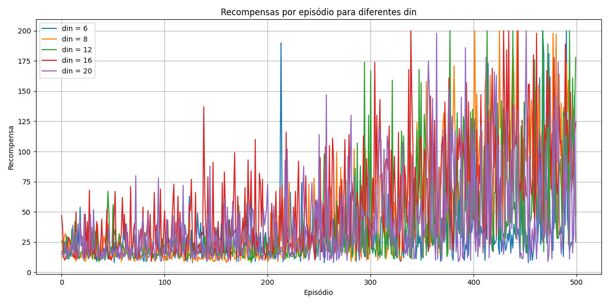
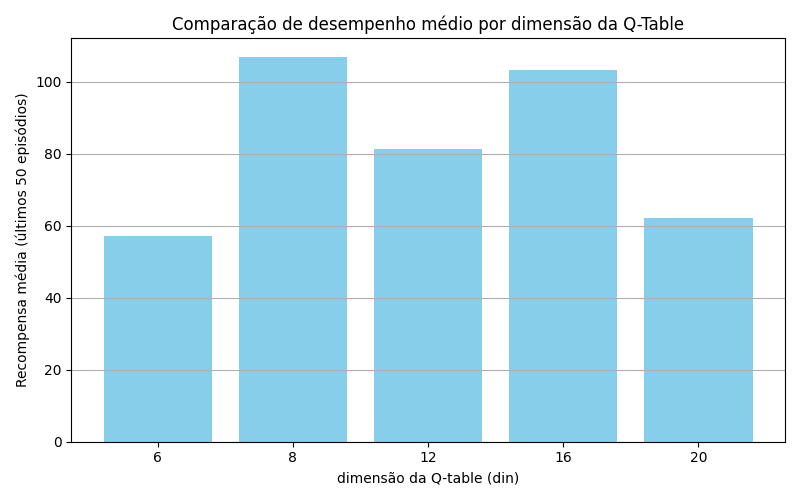

## Análise dos Resultados de Desempenho com Diferentes Dimensões da Q-Table

### Configuração do Experimento

* Ambiente: `CartPole-v1` (biblioteca `gymnasium`)
* Algoritmo: Q-Learning com discretização do espaço contínuo de estados
* Parâmetros fixos:

  * Número de episódios: 500
  * Máximo de passos por episódio: 200
  * Taxa de aprendizado (`learning_rate`, α): 0.1
  * Fator de desconto (`discount_factor`, γ): 0.99
  * Política exploratória com `epsilon-greedy`, decaindo com fator 0.995 até um mínimo de 0.01
* Parâmetro variável: `din = [6, 8, 12, 16, 20]` (quantidade de divisões por dimensão do espaço de estados)

---

### Gráfico 1 – Recompensas por Episódio

**Interpretação:**

* Os agentes começam com baixo desempenho, como esperado em fases iniciais de exploração.
* Os valores de `din = 8` e `din = 16` demonstram uma tendência mais rápida de crescimento na recompensa média ao longo dos episódios.
* Para `din = 6`, há um desempenho mais irregular e dificuldade de convergência estável, possivelmente por discretização grosseira.
* Já `din = 20` mostra mais ruído e dificuldade em generalizar, o que pode indicar **superdiscretização** (muitas divisões geram espaço de estados esparsamente visitado, dificultando aprendizado).
* `din = 12` mostra desempenho intermediário, com alguma instabilidade.

---

### Gráfico 2 – Comparação das Médias das Últimas 50 Recompensas

**Resultados médios aproximados das últimas 50 execuções:**

| din | Recompensa Média |
| --- | ---------------- |
| 6   | \~57             |
| 8   | \~107            |
| 12  | \~82             |
| 16  | \~103            |
| 20  | \~62             |

**Conclusões:**

* As melhores médias finais foram alcançadas com `din = 8` e `din = 16`.
* Isso sugere que há um **compromisso ideal entre granularidade da discretização e cobertura do espaço de estados**.
* Valores baixos de `din` (como 6) simplificam demais a representação do ambiente, enquanto valores altos (como 20) geram alta dimensionalidade, dificultando aprendizado por esparsidade e necessidade de mais episódios.
* A escolha do valor de `din` influencia fortemente o desempenho do agente Q-Learning em ambientes contínuos como o CartPole.

---

### Considerações Finais

* A discretização adequada do espaço de estados é crucial para algoritmos baseados em Q-Tables.
* Há evidência empírica de que `din = 8` ou `16` fornecem um bom equilíbrio entre precisão e eficiência.
* Para tarefas mais complexas ou ambientes com alta dimensionalidade, algoritmos baseados em aproximação de função (ex: DQN) podem ser mais adequados, evitando a explosão combinatória da Q-Table.

