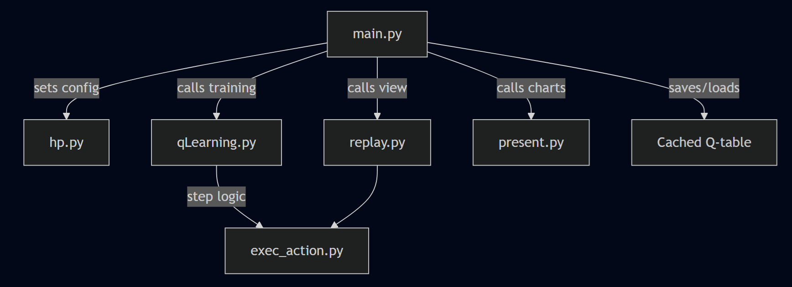
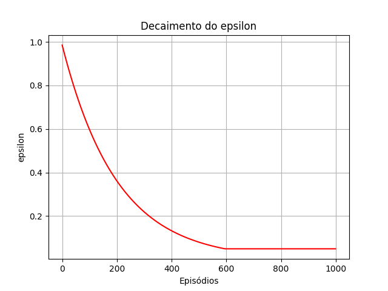
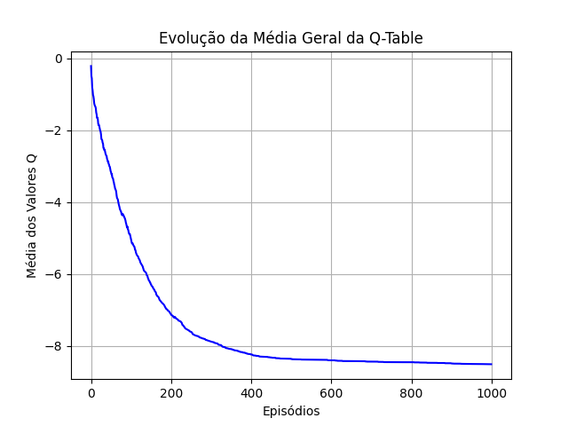
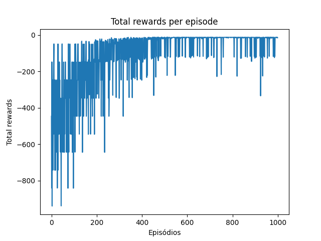
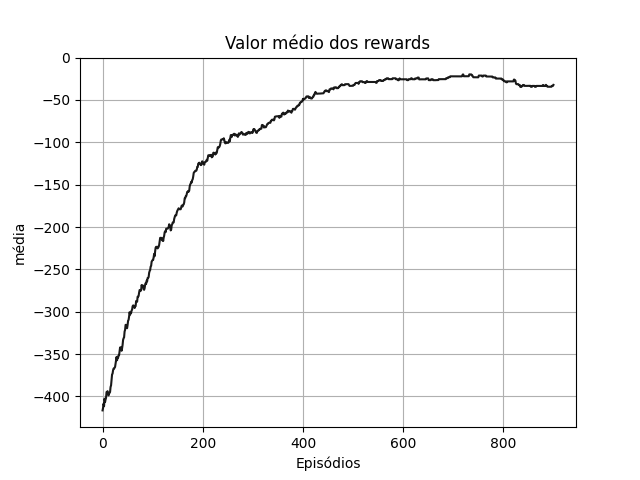

# Taxi Q-Learning Reinforcement Learning Agent

This project implements a Q-learning agent using OpenAI's Gymnasium environment `Cliff-Environmnent-v0`. The solut0ion supports training, evaluation, and visualization of the learning process. It includes enhancements like stubbornness handling for non-progressing states and visual tracking of training metrics.

---

## Features

- **Q-Learning Agent** with epsilon-greedy exploration
- **Stubbornness mechanism** to detect and handle repeated ineffective actions
- **Auto-configuration validation and cache** to avoid redundant training
- **Training metrics visualization** (epsilon decay, Q-table evolution, rewards)
- Multiple execution modes: training, notebook-friendly replay, and human-readable view

---

## Directory Structure

```
├── exec_action.py # Handles single-step environment interaction with stubbornness logic
├── hp.py # Defines and manages hyperparameters and hashing logic
├── main.py # Entrypoint: orchestrates training, saving/loading, and replay
├── present.py # Visualization: plots charts for training analysis
├── qLearning.py # Core Q-learning logic
├── replay.py # Handles replay of learned policy
├── Taxi.ipynb # Optional notebook for interactive inspection
├── temp/ # Folder used to cache training runs based on configuration
└── fig/ # Folder where charts are saved (if modified to do so)
```

## Solution Diagram



---

## How to Use

### 1. Install Dependencies

Ensure you have Python 3.8+ and install the required libraries:

```bash
pip install gymnasium matplotlib tqdm
```

### 2. Run Training and Replay
bash
Copy
Edit
python main.py
Trains the agent if no matching configuration is cached.

Loads existing Q-table if parameters haven't changed.

Replays a few episodes showing step-by-step decisions.

### 3. Visualize Training Progress

**The environment:**


**After training, charts will be displayed using matplotlib showing:**








## Notes

*This setup uses the Cliff Walking-V0 environment by default but can be extended to other discrete Gym environments.*

 - get_config_hash() ensures each unique hyperparameter combination gets a unique cache file.

 - Stubborn action handling helps mitigate local cycles where the agent fails to progress.

# License
This project is open-source and intended for educational and experimental purposes.

